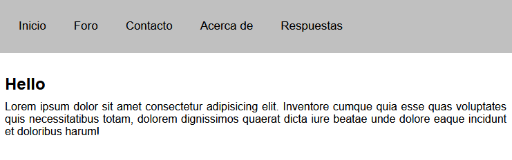
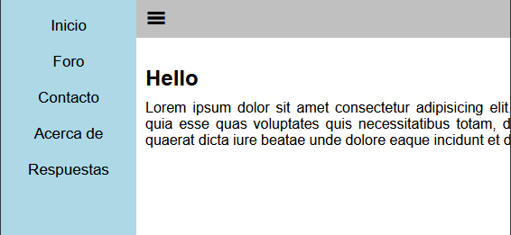

# MenuResponsiveLateral

This is a responsive html project, which will change the side menu of the web page, every time the different screen resolutions are changed.

---

## Table of contents

- [Description](#description)
- [Technologies](#technologies)
- [Installation](#installation)

## Description

This is a responsive html project, which will change the side menu of the web page, every time the different screen resolutions are changed. To show the side menu you will need to click on the hamburger menu.

## Technologies

The project has been created with:

- HTML
- CSS
- JS

## Installation

To run this project, we need the following steps:

- Download the Live Server extension, which is found in the vscode editor

- Once the extension is downloaded, run the extension and everything will work correctly

- If you get an error, try running the application normally using the index.html file
